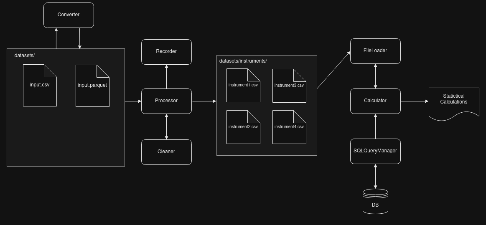

# Calculation Module

Module for statistical calculations for different financial instruments

From a data file it calculates:
1. the mean of INSTRUMENT1.
2. the mean of INSTRUMENT2 for November 2014.
3. the mean of INSTRUMENT3, it is calculated as the data is loaded.
4. sum of newest 10 items for any instrument except those mentioned above. 
5. calculates the final price for a specific instrument and date. The price of the record is multiplied by multipliers stored in the database.


**The input file must have a CVS extension.** 

For more information about configurations you can see the src/settings.py file.


## How it works
A suitable solution was to split the large file into smaller files by instruments.

Subsequent calculations can thus be accelerated because they are performed by instruments. At the same time, the total storage space can be reduced (by about 35%), since only the date and value can be stored into the datasets.



1. The Loader class loads the file by chunck size and sends the chunk to the PreProcesor for formatting and cleaning. It also sends the chunk of data to the Recorder to perform calculations "on-the-fly".
Finally, the Loader splits and saves files by instrument to speed up the calculation times.

2. When the any operation is selected (for example: mean of any instrument), the Calculator class asks the FileLoader class for the data, and the FileLoader class loads the data of the instrument from a small file.

3. when any final price is necessary to calculate, the Calculator ask for the multiplier for the SQLQueryManager to retrieve the information from the database.

## Features:

1. To load and transform the original dataset, the DASK library was used for memory control and to allow parallel processing.

2. However, the use of Dask increases the complexity, so Pandas was used to manipulate the datasets by instruments. Because the number of records is small. Approximately:
(newest year - oldest year) * record per day = (2014 - 1996) * 365 = 6570 records.

3. To recover the multipliers from the database, the data was cached (with a timeout of 5 seconds) and an index was created by instrument name to speed up the queries.

## Installation
1. Create the virtualenviroment and activate it:
```
    python3 -m venv venv
```
For linux
```
    source venv/bin/activate
```
2. Install requirements:
```
    pip install -r requirements.txt
```
3. Install sqlite3
```
sudo apt install sqlite3
```
4. Run:
```
    python3 src/main.py
```

## Test
1. Once the virtualenvironment is activated, run:
```
    python3 -m unittest discover
```

## Changelog
| Date    | Code | Version | Description | Link |
| -------- | ------- | -------- | ------- | -------
| 15.01.24  | 01    | v1.1.0  | Conversion to parquet format before process the original dataset | [Link](docs/v1.1.0.md)